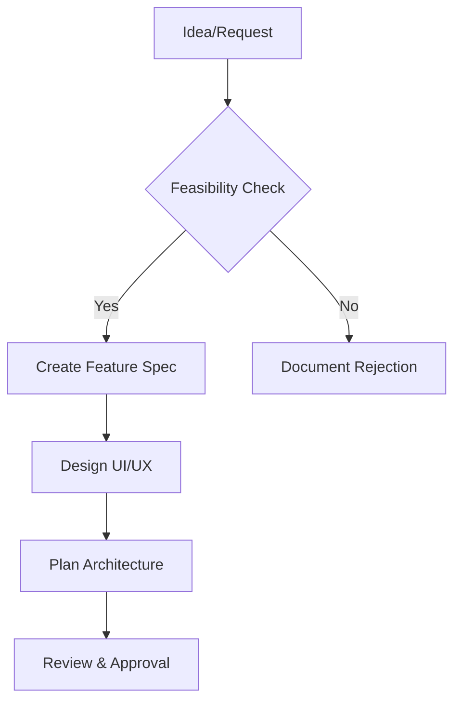

# ISO Toolkit - Improvement Pipeline

## Overview
This document outlines the systematic approach for improving, debugging, and adding features to the ISO Toolkit project.

---

## 1. Current Issues & Bugs

### High Priority
- [ ] **Database Connection Pool Exhaustion**
  - **Location**: `backend/api/routes/downloads.py:109`
  - **Error**: `QueuePool limit of size 5 overflow 10 reached, connection timed out`
  - **Fix**: Implement proper connection pooling, add context managers, close connections after use
  - **Assigned**: TBD

- [ ] **Logo URLs Returning 404 Errors**
  - **Location**: `frontend/src/assets/logos.ts`
  - **Issue**: Many distro logo URLs are guessed paths that don't exist
  - **Fix**: Implement logo fallback service, verify URLs on startup, use CDN mirrors
  - **Status**: In Progress - Updated to official website URLs, needs verification

### Medium Priority
- [ ] **No Error Boundary in React App**
  - **Issue**: Unhandled errors crash the entire app
  - **Fix**: Add Error Boundary component with user-friendly error pages

- [ ] **No Loading States for Logo Images**
  - **Issue**: Logos show nothing while loading, causing layout shift
  - **Fix**: Add skeleton loaders or placeholder colors

### Low Priority
- [ ] **Mobile Touch Targets**
  - **Issue**: Some buttons are smaller than 44x44px on mobile
  - **Fix**: Audit and fix all interactive elements

---

## 2. Feature Addition Workflow

### Phase 1: Planning


### Feature Specification Template
```markdown
## Feature: [Name]

### Problem Statement
What problem does this solve?

### Proposed Solution
How will we solve it?

### UI/UX Design
- [ ] Wireframes created
- [ ] User flows documented
- [ ] Mobile responsive considered

### Technical Approach
- Frontend components needed:
- Backend API endpoints needed:
- Database changes required:

### Success Criteria
- [ ] Feature works as expected
- [ ] No performance regression
- [ ] Mobile responsive
- [ ] Accessible (WCAG 2.1 AA)

### Testing Plan
- Unit tests:
- Integration tests:
- E2E tests:

### Estimated Effort
- Frontend: X hours
- Backend: X hours
- Testing: X hours
- Total: X hours
```

### Phase 2: Implementation Checklist
- [ ] Create feature branch from `develop`
- [ ] Set up TODO tracking in code
- [ ] Implement backend API first (if needed)
- [ ] Implement frontend components
- [ ] Add error handling
- [ ] Add loading states
- [ ] Test on mobile devices
- [ ] Write/update tests
- [ ] Update documentation
- [ ] Create PR for review

### Phase 3: Review & Merge
- [ ] Code review by 1+ team member
- [ ] All tests passing
- [ ] No console errors
- [ ] Performance check (Lighthouse score)
- [ ] Merge to `develop`
- [ ] Deploy to staging
- [ ] Test on staging
- [ ] Merge to `main`
- [ ] Deploy to production

---

## 3. Self-Debugging Mechanisms

### 3.1 Automated Health Checks

#### Backend Health Check
```python
# backend/api/routes/health.py
@router.get("/health")
async def health_check(db: Session = Depends(get_db)):
    checks = {
        "database": check_database(db),
        "downloads": check_downloads_directory(),
        "providers": check_os_providers(),
        "memory": check_memory_usage(),
    }
    return {
        "status": "healthy" if all(checks.values()) else "degraded",
        "checks": checks,
        "timestamp": datetime.utcnow().isoformat()
    }
```

#### Frontend Health Check
```typescript
// frontend/src/utils/health.ts
export async function checkHealth() {
  const checks = {
    api: await checkApiConnection(),
    websocket: checkWebSocketConnection(),
    localStorage: checkLocalStorage(),
  };
  return checks;
}
```

### 3.2 Error Tracking Service

#### Frontend Error Boundary
```typescript
// frontend/src/components/ErrorBoundary.tsx
interface ErrorBoundaryState {
  hasError: boolean;
  error: Error | null;
  errorInfo: React.ErrorInfo | null;
}

export class ErrorBoundary extends React.Component<
  {children: React.ReactNode},
  ErrorBoundaryState
> {
  state: ErrorBoundaryState = {
    hasError: false,
    error: null,
    errorInfo: null
  };

  static getDerivedStateFromError(error: Error) {
    return { hasError: true };
  }

  componentDidCatch(error: Error, errorInfo: React.ErrorInfo) {
    // Log to service
    logError('react-error', { error, errorInfo });

    this.setState({
      error,
      errorInfo
    });
  }

  render() {
    if (this.state.hasError) {
      return <ErrorFallback error={this.state.error} />;
    }
    return this.props.children;
  }
}
```

### 3.3 Logging Standards

#### Backend Logging
```python
# backend/api/utils/logger.py
import logging
import sys
from datetime import datetime

class StructuredLogger:
    def __init__(self, name: str):
        self.logger = logging.getLogger(name)
        self.logger.setLevel(logging.INFO)

        handler = logging.StreamHandler(sys.stdout)
        handler.setFormatter(logging.Formatter(
            '%(asctime)s - %(name)s - %(levelname)s - %(message)s'
        ))
        self.logger.addHandler(handler)

    def log_request(self, endpoint: str, method: str, duration_ms: float):
        self.logger.info(f"{method} {endpoint} - {duration_ms:.2f}ms")

    def log_error(self, error: Exception, context: dict):
        self.logger.error(f"Error: {str(error)} | Context: {context}")
```

#### Frontend Logging
```typescript
// frontend/src/utils/logger.ts
type LogLevel = 'info' | 'warn' | 'error';

interface LogEntry {
  level: LogLevel;
  message: string;
  context?: Record<string, unknown>;
  timestamp: string;
}

class Logger {
  private logs: LogEntry[] = [];

  log(level: LogLevel, message: string, context?: Record<string, unknown>) {
    const entry: LogEntry = {
      level,
      message,
      context,
      timestamp: new Date().toISOString()
    };

    this.logs.push(entry);

    // In development, log to console
    if (import.meta.env.DEV) {
      console[level](message, context || '');
    }

    // In production, send to error service
    if (level === 'error' && import.meta.env.PROD) {
      this.sendToErrorService(entry);
    }
  }

  info(message: string, context?: Record<string, unknown>) {
    this.log('info', message, context);
  }

  error(message: string, context?: Record<string, unknown>) {
    this.log('error', message, context);
  }
}

export const logger = new Logger();
```

### 3.4 Performance Monitoring

#### Frontend Performance
```typescript
// frontend/src/utils/performance.ts
export function measureRender(componentName: string) {
  return (target: any) => {
    const originalRender = target.prototype.render;

    target.prototype.render = function(...args: any[]) {
      const start = performance.now();
      const result = originalRender.apply(this, args);
      const end = performance.now();

      if (end - start > 16) { // More than one frame
        console.warn(`Slow render: ${componentName} took ${(end - start).toFixed(2)}ms`);
      }

      return result;
    };
  };
}
```

---

## 4. Code Quality Standards

### 4.1 TypeScript/React Standards

#### Component Template
```typescript
/**
 * Component description
 *
 * @param prop1 - Description
 * @param prop2 - Description
 */
export function ComponentName({
  prop1,
  prop2
}: ComponentNameProps): JSX.Element {
  // 1. Hooks (useState, useEffect, etc.)
  const [state, setState] = useState(initialValue);

  // 2. Derived values
  const derived = useMemo(() => compute(state), [state]);

  // 3. Effects
  useEffect(() => {
    // Side effects here
    return () => {
      // Cleanup
    };
  }, [dependencies]);

  // 4. Event handlers
  const handleClick = useCallback(() => {
    // Handle event
  }, [dependencies]);

  // 5. Render
  return (
    <div className="...">
      {/* JSX */}
    </div>
  );
}
```

#### Rules
- Always include TypeScript types
- Use `interface` for component props
- Use `type` for unions/intersections
- Prefer `const` over `let`
- Use meaningful variable names
- Add JSDoc comments for exports
- Keep components under 300 lines
- Extract complex logic to custom hooks

### 4.2 Python/FastAPI Standards

#### Route Template
```python
from fastapi import APIRouter, Depends, HTTPException
from sqlalchemy.orm import Session

router = APIRouter(prefix="/api/resource", tags=["resource"])

@router.get("/", response_model=List[ResourceResponse])
async def list_resources(
    skip: int = 0,
    limit: int = 100,
    db: Session = Depends(get_db)
) -> List[ResourceResponse]:
    """
    List all resources with pagination.

    Args:
        skip: Number of items to skip
        limit: Maximum number of items to return
        db: Database session

    Returns:
        List of resources
    """
    try:
        resources = db.query(Resource).offset(skip).limit(limit).all()
        return resources
    except Exception as e:
        logger.error(f"Failed to list resources: {e}")
        raise HTTPException(status_code=500, detail="Internal server error")
```

#### Rules
- Always type function parameters and return types
- Use Pydantic models for request/response
- Add docstrings to all functions
- Handle exceptions gracefully
- Log all errors
- Use dependency injection for database sessions
- Keep routes under 100 lines

---

## 5. Testing Strategy

### 5.1 Testing Pyramid

```
        E2E Tests (10%)
       /             \
      /               \
     /                 \
    /                   Integration Tests (30%)
   /                     \
  /                       Unit Tests (60%)
```

### 5.2 Frontend Testing

#### Unit Tests (Vitest)
```typescript
// Describe what you're testing
describe('DistroLogo', () => {
  // Test each behavior
  it('shows emoji when image fails to load', () => {
    render(<DistroLogo distroName="Ubuntu" />);
    const img = screen.getByRole('img');

    fireEvent.error(img);

    expect(screen.getByText('🟠')).toBeInTheDocument();
  });

  it('shows image when URL is valid', () => {
    render(<DistroLogo distroName="Ubuntu" />);

    const img = screen.getByRole('img');
    expect(img).toHaveAttribute('src');
  });
});
```

#### Integration Tests
```typescript
describe('BrowseOS Page', () => {
  it('loads Linux subcategories when Linux is selected', async () => {
    renderWithProviders(<BrowsePage />);

    const linuxButton = screen.getByText('Linux');
    fireEvent.click(linuxButton);

    await waitFor(() => {
      expect(screen.getByText('Ubuntu')).toBeInTheDocument();
    });
  });
});
```

### 5.3 Backend Testing

#### Unit Tests (pytest)
```python
def test_get_linux_subcategories(db_session):
    """Test that Linux subcategories are returned correctly."""
    # Arrange
    create_test_os(db_session, category="linux", subcategory="Ubuntu")
    create_test_os(db_session, category="linux", subcategory="Fedora")

    # Act
    response = client.get("/api/os/linux/subcategories")

    # Assert
    assert response.status_code == 200
    assert len(response.json()) == 2
```

#### Integration Tests
```python
def test_download_flow(db_session, mock_download_manager):
    """Test the complete download workflow."""
    # Create test OS
    os_id = create_test_os(db_session).id

    # Start download
    response = client.post("/api/downloads/start", json={"os_id": os_id})

    # Verify
    assert response.status_code == 200
    assert mock_download_manager.start.called
```

---

## 6. Continuous Improvement Checklist

### Daily (During Development)
- [ ] Run linter before committing
- [ ] Check for console errors
- [ ] Test on mobile viewport
- [ ] Review any failed tests

### Weekly
- [ ] Update dependencies
- [ ] Review and address TODO comments
- [ ] Check for security vulnerabilities
- [ ] Review error logs

### Monthly
- [ ] Performance audit (Lighthouse)
- [ ] Accessibility audit
- [ ] Code review with team
- [ ] Update documentation
- [ ] Plan next sprint features

---

## 7. Debugging Procedures

### 7.1 Frontend Debugging

#### Browser Console Errors
1. Open browser DevTools (F12)
2. Go to Console tab
3. Filter by "Error"
4. Click on error source
5. Check:
   - Is the file path correct?
   - Are imports correct?
   - Is the syntax valid?

#### Network Failures
1. Go to Network tab
2. Find failed request (red)
3. Check:
   - URL is correct
   - Request method matches
   - Request body is valid
   - Response status code
   - Response body error message

#### React Component Issues
1. Install React DevTools
2. Check component props
3. Check component state
4. Check for infinite re-renders
5. Verify useEffect dependencies

### 7.2 Backend Debugging

#### API Errors
1. Check server logs
2. Verify route exists
3. Check request validation
4. Test with Swagger UI (`/docs`)
5. Check database connection

#### Database Issues
1. Check database is running
2. Verify connection string
3. Check for locked tables
4. Review query syntax
5. Check for connection leaks

---

## 8. Release Process

### Pre-Release Checklist
- [ ] All tests passing
- [ ] No console errors
- [ ] Performance audit passed (Score > 90)
- [ ] Security scan passed
- [ ] Documentation updated
- [ ] CHANGELOG.md updated
- [ ] Version bumped

### Release Steps
1. Create git tag: `vX.Y.Z`
2. Build production assets
3. Run database migrations
4. Deploy to production
5. Smoke test critical paths
6. Monitor error logs for 1 hour
7. Announce release

---

## 9. Monitoring & Alerts

### Key Metrics to Track

#### Frontend
- Page load time
- Time to interactive
- Error rate
- API response times
- WebSocket connection failures

#### Backend
- Request rate
- Response times (p50, p95, p99)
- Error rate by endpoint
- Database query times
- Active connections

### Alert Thresholds
- Error rate > 1% → Alert
- Response time > 2s → Warning
- Response time > 5s → Critical
- Database pool exhausted → Critical

---

## 10. Documentation Standards

### Code Documentation
```typescript
/**
 * Fetches OS information by category
 *
 * @example
 * ```ts
 * const oss = await osAPI.getByCategory('linux');
 * ```
 *
 * @throws {ApiError} When the API request fails
 * @param category - The OS category to fetch
 * @param subcategory - Optional subcategory filter
 * @returns Promise resolving to OS info array
 */
async getByCategory(
  category: OSCategory,
  subcategory?: string
): Promise<OSInfo[]>
```

### README Requirements
Each major module should have:
- Purpose description
- Installation instructions
- Usage examples
- Configuration options
- Troubleshooting section

---

## 11. Quick Reference

### Common Commands

#### Frontend
```bash
# Development
npm run dev

# Type check
npm run type-check

# Lint
npm run lint

# Format
npm run format

# Test
npm run test

# Build
npm run build
```

#### Backend
```bash
# Development
uvicorn api.main:app --reload

# Type check
mypy backend/

# Lint
ruff check backend/

# Format
ruff format backend/

# Test
pytest backend/

# Run with coverage
pytest --cov=backend backend/
```

### Git Workflow
```bash
# Start feature
git checkout -b feature/feature-name

# Commit with conventional commits
git commit -m "feat: add user authentication"

# Push and create PR
git push origin feature/feature-name

# After review, squash and merge
```

---

## 12. Future Improvements

### Short Term (Next Sprint)
- [ ] Fix database connection pool issue
- [ ] Implement error boundary
- [ ] Add logo verification system
- [ ] Write unit tests for core components

### Medium Term (Next Quarter)
- [ ] Set up CI/CD pipeline
- [ ] Add E2E testing with Playwright
- [ ] Implement caching for OS list
- [ ] Add dark/light theme toggle

### Long Term (Next 6 Months)
- [ ] PWA support for offline usage
- [ ] User accounts for saving preferences
- [ ] Download resume support
- [ ] Multiple mirror support for downloads

---

Last Updated: 2026-01-10
Version: 1.0.0
Maintainer: Development Team
